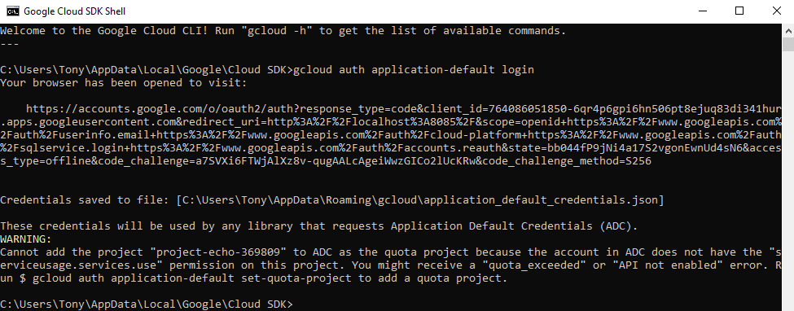
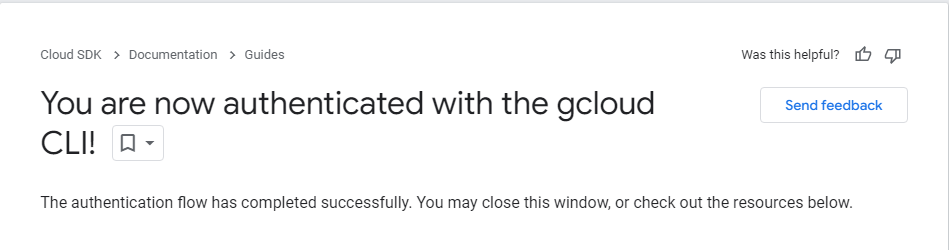

# Project Otways Dataset Store

Owner: Engine team
Status: offline data pipeline moved out of the current production tree
Runtime role: none. This folder is not a Docker Compose service.

The ownership review marks this folder as Engine-owned offline data work. It was moved from `src/production/Store` to `src/data_tools/store` after `rg` found no non-generated references to the old path. Keep the notebooks and sample data in place during this reorganisation pass; do not delete audio clips, generated CSVs, notebook outputs, or credentials-like files until the data storage policy and migration target are confirmed.

## Cloud Buckets

There are currently 5 versions of this dataset up on Google Cloud Storage. They are as the following:

project_echo_bucket 1-: Sim data is uploaded here, number of species must match training species = 122, folder names are scientific species names. 

project_echo birdclef / project_echo_bucket 2-: Training data is uploaded here = 122 DO NOT MIX WITH SIM DATA. 

project_echo_bucket 3-: This bucket contains segmented data = 227.

project_echo_bucket 4-: This bucket contains all the full length audio we have collected > 440 species 

project_echo_bucket 5-: This bucket contains cleaned up audio legacy data clips of up to 10s each with silences filtered out (currently in bucket 3).  

Google Cloud Project name: sit-23t1-project-echo-25288b9

## Instructions

This folder contains the code that give access to the Google Cloud Storage for the Project otways Dataset. Please follow the instructions below:

1. Install google cloud storage on your local dev environment
pip install google-cloud-storage

2. Install the Coogle Cloud CLI https://cloud.google.com/sdk/docs/install

3. Once installed, open the shell and type "gcloud auth application-default login". It will open up a browser.
Log in using your deakin credentials (xxxxxx@deakin.edu.au) and sign in using 2FA

You should see this if you're successfully authenticated

4. Open GoogleCloud_download.ipynb Bucket name is currently 'project_echo_bucket_1'. set dl_dir to the path where you want the dataset to be stored.

5. Run the python script. It should take around 20 minutes depending on the speed of your connection.

### Other scripts

audio_cleaning is responsible for removing the silences and voices at the start of each audio clip
GoogleCloud_upload can upload datasets to the online storage bucket
web_scraping_ala is used to scrape audio data from Atlas of Living Australia website
txt_cleaning is used to extraxt species found in the Otways from the book: __Grant Palmer. Wildlife of the Otways and Shipwreck Coast. Clayton, VIC: CSIRO PUBLISHING, 2019.__
audio_cleaning_2 is responsible for refining training data to detect sound onsets so no clip would be pure silence or background noise.

## Reorganisation Notes

Move completed in this slice:

- Old path: `src/production/Store`
- New path: `src/data_tools/store`
- Reference check: `rg` found no non-generated references to the old path before the move.

Follow-up checks:

- Notebook paths in `GoogleCloud_download.ipynb`, `GoogleCloud_upload.ipynb`, `metadata.ipynb`, `duplicates.ipynb`, `audio_cleaning*.ipynb`, and database notebooks.
- References from `src/production/Engine` and `src/production/Simulator`.
- Whether `database/sample_data/` duplicates MongoDB seed data or prototype data under `src/prototypes/data/database/`.
- Whether generated files such as `out.csv`, `out_2.txt`, `database/out.txt`, and temporary WAV files should be externalised or ignored.
